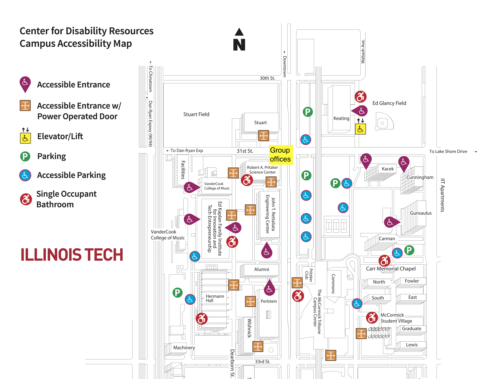
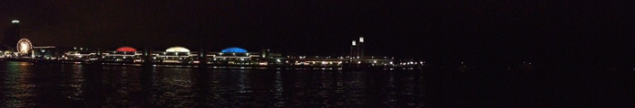

# Former Illinois Tech location

For historical reference, the group was located on the second floor of the Robert A. Pritzker Science Center on the Mies campus of Illinois Tech, near the corner of 31st and State streets. David&rsquo;s former office was in room 390, and the group was in room 234. David Minh is no longer affiliated with Illinois Tech; these locations should not be used as current contact information.

<!-- 

!-->

# Campus  

# From 31st street beach, near campus

